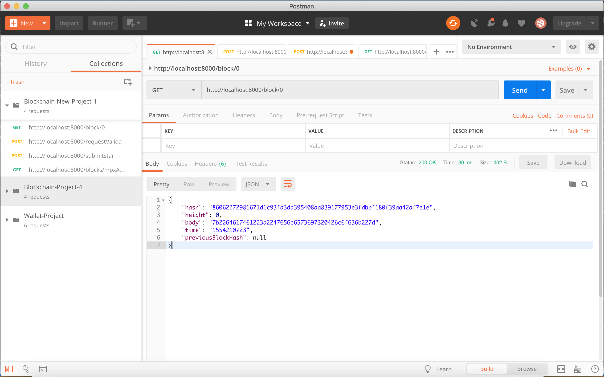
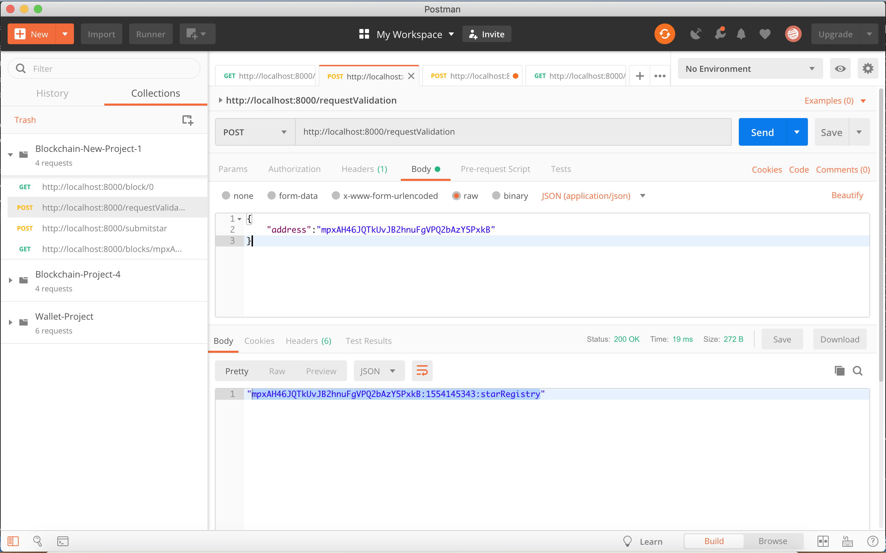
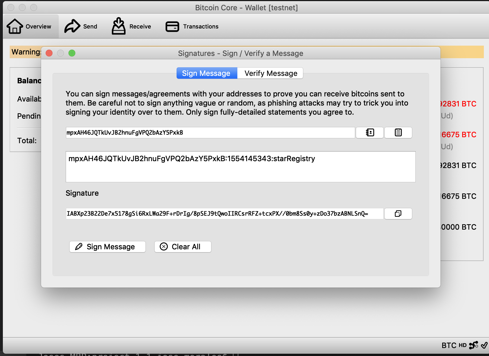
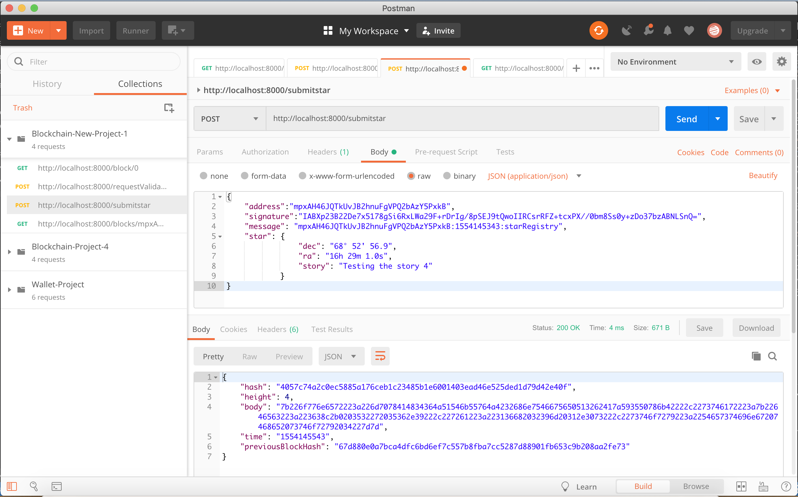
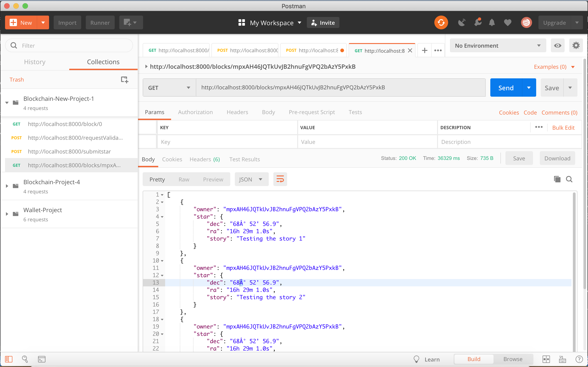

## How to test your application functionality?

To test your application I recommend you to use POSTMAN, this tool will help you to make the requests to the API. Always is useful to debug your code see what is happening in your algorithm, so I will let you this video for you to check on how to do it [Debug Video](https://www.youtube.com/watch?v=6cOsxaNC06c) . Try always to debug your code to understand what you are doing.

1. Run your application using the command

    

   ```
   node app.js
   ```

    

   You should see in your terminal a message indicating that the server is listening in port 8000:

   > Server Listening for port: 8000


1. To make sure your application is working fine and it creates the Genesis Block you can use POSTMAN to request the Genesis block:


[](https://classroom.udacity.com/nanodegrees/nd1309/parts/53e66ef0-a374-48e3-b616-d9d1849d6ec3/modules/91f4081c-1c02-47ab-a2b2-ac03c0b5fa38/lessons/6d3b2863-9508-43a8-8b0e-c83e7b14db61/concepts/2c868c0d-3ce3-4679-98ff-ba4a77ea2c27#)


1. Make your first request of ownership sending your wallet address:


[](https://classroom.udacity.com/nanodegrees/nd1309/parts/53e66ef0-a374-48e3-b616-d9d1849d6ec3/modules/91f4081c-1c02-47ab-a2b2-ac03c0b5fa38/lessons/6d3b2863-9508-43a8-8b0e-c83e7b14db61/concepts/2c868c0d-3ce3-4679-98ff-ba4a77ea2c27#)


1. Sign the message with your Wallet:


[](https://classroom.udacity.com/nanodegrees/nd1309/parts/53e66ef0-a374-48e3-b616-d9d1849d6ec3/modules/91f4081c-1c02-47ab-a2b2-ac03c0b5fa38/lessons/6d3b2863-9508-43a8-8b0e-c83e7b14db61/concepts/2c868c0d-3ce3-4679-98ff-ba4a77ea2c27#)


1. Submit your Star


[](https://classroom.udacity.com/nanodegrees/nd1309/parts/53e66ef0-a374-48e3-b616-d9d1849d6ec3/modules/91f4081c-1c02-47ab-a2b2-ac03c0b5fa38/lessons/6d3b2863-9508-43a8-8b0e-c83e7b14db61/concepts/2c868c0d-3ce3-4679-98ff-ba4a77ea2c27#)


1. Retrieve Stars owned by me


[](https://classroom.udacity.com/nanodegrees/nd1309/parts/53e66ef0-a374-48e3-b616-d9d1849d6ec3/modules/91f4081c-1c02-47ab-a2b2-ac03c0b5fa38/lessons/6d3b2863-9508-43a8-8b0e-c83e7b14db61/concepts/2c868c0d-3ce3-4679-98ff-ba4a77ea2c27#)


https://classroom.udacity.com/nanodegrees/nd1309/parts/53e66ef0-a374-48e3-b616-d9d1849d6ec3/modules/91f4081c-1c02-47ab-a2b2-ac03c0b5fa38/lessons/6d3b2863-9508-43a8-8b0e-c83e7b14db61/concepts/2c868c0d-3ce3-4679-98ff-ba4a77ea2c27